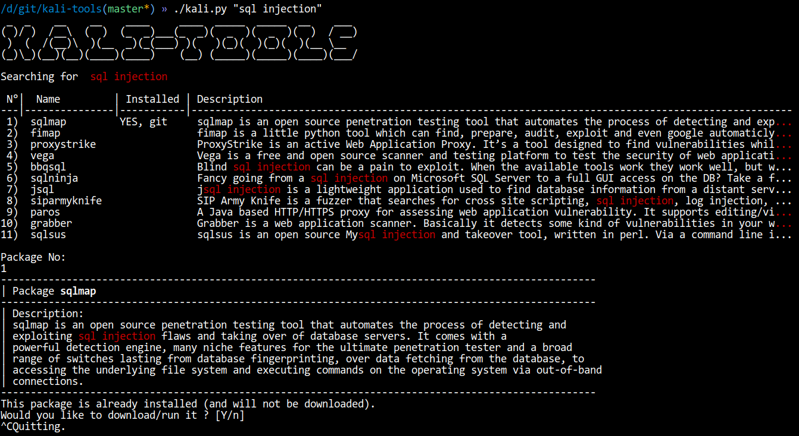

# Kali Tools

This repo gives access to **all kali tools**, on every Linux distributions. More specifically, it clones the source repo of the packages (and install them if needed).

Additionnally, it allows **searching** for tools, a feature I was dearly missing even in Kali. Searching works on packages name **and descriptions** (which were curated, then hardcoded in this repo to avoid unneeded network access).

Author: Ludovic Barman

# searching for SQL injection

## If no search term is given, it displays the kali menu:

